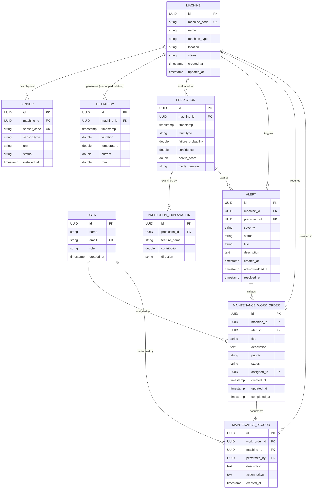

# System Architecture Specification

**Project Title:** AI/ML IoT-Based Predictive Maintenance for Industrial Machines  
**Document Version:** 1.0.0  
**Status:** Approved Architectural Specification (Milestone 0)

---

## 1. System Overview & Problem Statement

In heavy manufacturing and industrial plants, unpredicted mechanical equipment failures (e.g., motor bearing defects, rotor imbalances, thermal breakdown, mechanical looseness) cause catastrophic operational interruptions, high repair costs, and personnel safety hazards.

This platform provides a closed-loop, production-inspired predictive maintenance solution. It ingests high-frequency multi-sensor telemetry, extracts time-domain and frequency-domain (FFT) features, predicts impending failures using machine learning, explains risk factors via SHAP (SHapley Additive exPlanations), and delivers an interactive **Spring AI Maintenance Copilot** backed by RAG and controlled tool execution with human-in-the-loop governance.

---

## 2. High-Level Architectural Blueprint

The platform adopts a **Modular Monolith** architecture for the enterprise backend, complemented by a specialized **Python ML Service** for scientific computing and explainability, and an **IoT Layer** operating over MQTT.

```
+-----------------------------------------------------------------------------+
|                                 IoT Layer                                   |
|  [ESP32 / Real Sensors]  OR  [Multi-Sensor Telemetry Simulator]              |
|  (Vibration: mm/s, Temp: °C, Current: A, RPM: rev/min)                      |
+-----------------------------------------------------------------------------+
                                       │
                                       │ MQTT (QoS 1)
                                       ▼
+-----------------------------------------------------------------------------+
|                          Eclipse Mosquitto Broker                           |
|                       Topic: industrial/telemetry/#                         |
+-----------------------------------------------------------------------------+
                                       │
                                       │ Inbound MQTT Channel
                                       ▼
+=============================================================================+
|                      Spring Boot Backend (Modular Monolith)                 |
|                                                                             |
|  +---------------------+  +---------------------+  +---------------------+  |
|  |   telemetry Module  |  |    machine Module   |  |  prediction Module  |  |
|  | - MQTT Consumer     |  | - Machine Entity    |  | - ML Service Client |  |
|  | - Telemetry Service |  | - Sensor Entity     |  | - Prediction Record |  |
|  | - Time-series Repo  |  | - Machine Repo      |  | - SHAP Attribution  |  |
|  +---------------------+  +---------------------+  +---------------------+  |
|             │                         │                        ▲            |
|             │                         │                        │ REST / JSON|
|             ▼                         ▼                        ▼            |
|  +-----------------------------------------------------------------------+  |
|  |                           PostgreSQL 16                               |  |
|  |    Schema managed by Flyway (Hibernate: ddl-auto = validate)          |  |
|  +-----------------------------------------------------------------------+  |
|             ▲                         ▲                        ▲            |
|             │                         │                        │            |
|  +---------------------+  +---------------------+  +---------------------+  |
|  |     alert Module    |  |  maintenance Module |  |      ai Module      |  |
|  | - Anomaly Evaluator |  | - Work Orders       |  | - Spring AI Copilot |  |
|  | - Adaptive Bound    |  | - Maintenance Logs  |  | - Manuals RAG Engine|  |
|  | - Alert Lifecycle   |  | - Human Approval    |  | - Tool Calling Svc  |  |
|  +---------------------+  +---------------------+  +---------------------+  |
+=============================================================================+
                                       │
                        HTTP REST / Ingestion / Query
                                       │
                                       ▼
+-----------------------------------------------------------------------------+
|                         Python ML & Signal Service                          |
|  - Time-Domain & Statistical Feature Extraction (RMS, Kurtosis, Skewness)   |
|  - Frequency-Domain FFT Spectral Analysis (Peak Freq, Spectral Energy)     |
|  - Tabular Classifier (Random Forest / XGBoost)                             |
|  - Failure Probability & Dynamic Health Score (0 - 100)                     |
|  - TreeSHAP Feature Attribution Explainer                                   |
+-----------------------------------------------------------------------------+
```

---

## 3. Core Architectural Decisions & Boundaries

### 3.1 Modular Monolith Backend (Java 21 / Spring Boot 3.x)
- **Pattern**: A single deployable artifact structured into strictly isolated internal domain modules.
- **Package Hierarchy**:
  ```
  com.pmp.predictivemaintenance/
  ├── machine/          # Machine & physical sensor catalog
  ├── telemetry/        # Telemetry ingestion, validation, and historical queries
  ├── prediction/       # ML integration client, prediction records, SHAP explanations
  ├── alert/            # Anomaly rules, adaptive thresholds, alert management
  ├── maintenance/      # Work orders, human approval workflows, maintenance records
  ├── ai/               # Spring AI configuration, Copilot prompts, tool calling, RAG
  └── common/           # Cross-cutting concerns: exceptions, DTOs, auditing, security
  ```
- **Rules of Engagement**:
  - Modules interact via standard Java service interfaces, not cross-module direct entity queries.
  - Entities are never leaked outside the web layer; all API contracts use Data Transfer Objects (DTOs).
  - Business logic is strictly housed in `@Service` classes; data access is encapsulated in `@Repository` interfaces.

### 3.2 Python ML & Signal Processing Service
- **Why Decoupled?** High-performance scientific routines (SciPy FFT, NumPy vectorized math, scikit-learn ensemble trees, SHAP calculation) are native to Python. Embedding these directly into the JVM via JNI or Python bridges adds brittle native dependencies.
- **Contract**: Communication between Spring Boot and the Python ML service occurs via structured HTTP REST JSON payloads.
- **Responsibilities**:
  1. Buffer telemetry window (e.g., last 64 or 128 samples).
  2. Compute statistical features (mean, std, RMS, peak-to-peak, crest factor, kurtosis).
  3. Compute FFT spectral features on vibration signals (dominant frequency, spectral power).
  4. Run model inference to produce `failureProbability` and `faultType`.
  5. Calculate TreeSHAP values for the current inference window.
  6. Compute normalized `healthScore` (0 to 100).

### 3.3 IoT & Ingestion Strategy
- **Phase 1 (Initial)**: Synthetic Multi-Sensor Telemetry Simulator. Generates realistic sensor readings across normal, degraded, and imminent-failure operating modes over MQTT.
- **Phase 2 (Subsequent)**: Physical ESP32 microcontrollers reading real vibration (accelerometer), temperature (thermistor/DS18B20), current (ACS712), and tachometer (Hall effect RPM) sensors.
- **Firmware Role**: The ESP32 acts strictly as an I/O sensor reader and MQTT publisher. No TinyML or Edge AI is deployed on the microcontroller to avoid memory exhaustion and debugging opacity.
- **Broker**: Eclipse Mosquitto operating on standard MQTT port 1883 with QoS 1 to guarantee at-least-once delivery.

### 3.4 Spring AI Role & Security Boundaries
- **Clear Distinction**: Traditional ML computes the math (features, probabilities, SHAP vectors). Spring AI provides **natural language reasoning, contextual explanation, and assisted orchestration**.
- **No Direct Database Access**: The LLM / Spring AI Copilot is **strictly barred** from issuing direct SQL queries or interacting with JPA repositories.
- **Controlled Tool Calling**: Spring AI interacts with the system exclusively through designated Spring Service facade tools:
  - `getMachineHealth(UUID machineId)`
  - `getLatestTelemetry(UUID machineId)`
  - `getPrediction(UUID machineId)`
  - `getMachineHistory(UUID machineId, int days)`
  - `getActiveAlerts(UUID machineId)`
  - `getMaintenanceHistory(UUID machineId)`
- **Human-in-the-Loop Safeguard**: Spring AI can formulate recommendations, but cannot execute mutating or safety-critical operations (e.g., dispatching work orders, scheduling emergency machine shutdown). All work orders require explicit engineer approval.

---

## 4. Domain Model & Relational Schema

### 4.1 Entity Relationship Diagram (ERD)



### 4.2 Data Dictionaries

#### `machines`
| Field | Type | Constraints | Description |
| :--- | :--- | :--- | :--- |
| `id` | UUID | PK, NOT NULL | Unique machine identifier |
| `machine_code`| VARCHAR(64) | UK, NOT NULL | Business asset code (e.g. `CNC-LATHE-01`) |
| `name` | VARCHAR(128) | NOT NULL | Human-readable machine name |
| `machine_type`| VARCHAR(64) | NOT NULL | Category (e.g. `Centrifugal Pump`, `Induction Motor`) |
| `location` | VARCHAR(128) | NOT NULL | Physical plant location (e.g. `Shop Floor A - Bay 3`) |
| `status` | VARCHAR(32) | NOT NULL | `ACTIVE`, `INACTIVE`, `MAINTENANCE`, `DECOMMISSIONED` |
| `created_at` | TIMESTAMPTZ | NOT NULL | Record creation timestamp |
| `updated_at` | TIMESTAMPTZ | NOT NULL | Record modification timestamp |

#### `sensors`
| Field | Type | Constraints | Description |
| :--- | :--- | :--- | :--- |
| `id` | UUID | PK, NOT NULL | Unique sensor identifier |
| `machine_id` | UUID | FK -> `machines(id)`, NOT NULL | Parent machine reference |
| `sensor_code` | VARCHAR(64) | UK, NOT NULL | Device serial code (e.g. `ACCEL-VIB-01A`) |
| `sensor_type` | VARCHAR(32) | NOT NULL | `VIBRATION`, `TEMPERATURE`, `CURRENT`, `RPM` |
| `unit` | VARCHAR(16) | NOT NULL | Unit of measure (`mm/s`, `°C`, `A`, `RPM`) |
| `status` | VARCHAR(32) | NOT NULL | `ACTIVE`, `INACTIVE`, `FAULTY` |
| `installed_at`| TIMESTAMPTZ | NOT NULL | Installation date |

#### `telemetries` (High-Volume Stream)
> **Crucial JPA Implementation Note**: To prevent catastrophic JVM `OutOfMemoryError` incidents under industrial telemetry loads, `Machine` will **never** contain a collection `List<Telemetry>`. Telemetry records will be indexed on `(machine_id, timestamp DESC)` and fetched via paginated or windowed repository queries only.

| Field | Type | Constraints | Description |
| :--- | :--- | :--- | :--- |
| `id` | UUID | PK, NOT NULL | Unique telemetry point identifier |
| `machine_id` | UUID | FK -> `machines(id)`, NOT NULL | Target machine identifier |
| `timestamp` | TIMESTAMPTZ | NOT NULL | Sample collection timestamp |
| `vibration` | DOUBLE PRECISION | NOT NULL | Vibration amplitude / velocity (mm/s) |
| `temperature`| DOUBLE PRECISION | NOT NULL | Surface/bearing temperature (°C) |
| `current` | DOUBLE PRECISION | NOT NULL | Motor drive current (A) |
| `rpm` | DOUBLE PRECISION | NOT NULL | Rotational speed (rev/min) |

#### `predictions`
| Field | Type | Constraints | Description |
| :--- | :--- | :--- | :--- |
| `id` | UUID | PK, NOT NULL | Unique prediction event identifier |
| `machine_id` | UUID | FK -> `machines(id)`, NOT NULL | Target machine |
| `timestamp` | TIMESTAMPTZ | NOT NULL | Timestamp of prediction execution |
| `fault_type` | VARCHAR(64) | NOT NULL | e.g., `NORMAL`, `BEARING_FAULT`, `ROTOR_UNBALANCE` |
| `failure_probability` | DOUBLE PRECISION | NOT NULL | Model failure likelihood between `0.0` and `1.0` |
| `confidence` | DOUBLE PRECISION | NOT NULL | Model inference certainty between `0.0` and `1.0` |
| `health_score`| DOUBLE PRECISION | NOT NULL | Normalized asset health from `0.0` to `100.0` |
| `model_version`| VARCHAR(32) | NOT NULL | Version identifier of deployed ML model |

#### `prediction_explanations` (SHAP Values)
| Field | Type | Constraints | Description |
| :--- | :--- | :--- | :--- |
| `id` | UUID | PK, NOT NULL | Unique explanation item identifier |
| `prediction_id` | UUID | FK -> `predictions(id)`, NOT NULL | Parent prediction reference |
| `feature_name`| VARCHAR(64) | NOT NULL | Engineered feature (e.g. `vib_rms`, `temp_mean`) |
| `contribution`| DOUBLE PRECISION | NOT NULL | SHAP attribution value |
| `direction` | VARCHAR(16) | NOT NULL | `INCREASES_RISK`, `DECREASES_RISK` |

#### `alerts`
| Field | Type | Constraints | Description |
| :--- | :--- | :--- | :--- |
| `id` | UUID | PK, NOT NULL | Unique alert identifier |
| `machine_id` | UUID | FK -> `machines(id)`, NOT NULL | Target machine |
| `prediction_id`| UUID | FK -> `predictions(id)`, NULLABLE| Associated ML prediction |
| `severity` | VARCHAR(16) | NOT NULL | `LOW`, `MEDIUM`, `HIGH`, `CRITICAL` |
| `status` | VARCHAR(16) | NOT NULL | `OPEN`, `ACKNOWLEDGED`, `RESOLVED` |
| `title` | VARCHAR(128) | NOT NULL | Short alert summary |
| `description`| TEXT | NOT NULL | Detailed anomaly explanation |
| `created_at` | TIMESTAMPTZ | NOT NULL | Alert trigger timestamp |
| `acknowledged_at`| TIMESTAMPTZ | NULLABLE | Acknowledgment timestamp |
| `resolved_at`| TIMESTAMPTZ | NULLABLE | Resolution timestamp |

#### `maintenance_work_orders`
| Field | Type | Constraints | Description |
| :--- | :--- | :--- | :--- |
| `id` | UUID | PK, NOT NULL | Unique work order identifier |
| `machine_id` | UUID | FK -> `machines(id)`, NOT NULL | Machine to service |
| `alert_id` | UUID | FK -> `alerts(id)`, NULLABLE | Root cause alert |
| `title` | VARCHAR(128) | NOT NULL | Work order title |
| `description`| TEXT | NOT NULL | Prescribed maintenance steps |
| `priority` | VARCHAR(16) | NOT NULL | `LOW`, `MEDIUM`, `HIGH`, `EMERGENCY` |
| `status` | VARCHAR(16) | NOT NULL | `OPEN`, `ASSIGNED`, `IN_PROGRESS`, `COMPLETED`, `CANCELLED` |
| `assigned_to` | UUID | FK -> `users(id)`, NULLABLE | Assigned technician / engineer |
| `created_at` | TIMESTAMPTZ | NOT NULL | Work order creation timestamp |
| `updated_at` | TIMESTAMPTZ | NOT NULL | Last update timestamp |
| `completed_at`| TIMESTAMPTZ | NULLABLE | Close-out timestamp |

#### `maintenance_records`
| Field | Type | Constraints | Description |
| :--- | :--- | :--- | :--- |
| `id` | UUID | PK, NOT NULL | Unique record identifier |
| `work_order_id`| UUID | FK -> `maintenance_work_orders(id)`, NOT NULL | Parent work order |
| `machine_id` | UUID | FK -> `machines(id)`, NOT NULL | Machine serviced |
| `performed_by`| UUID | FK -> `users(id)`, NOT NULL | Executing engineer |
| `description`| TEXT | NOT NULL | Findings upon inspection |
| `action_taken`| TEXT | NOT NULL | Maintenance actions executed |
| `created_at` | TIMESTAMPTZ | NOT NULL | Record submission timestamp |

#### `users`
| Field | Type | Constraints | Description |
| :--- | :--- | :--- | :--- |
| `id` | UUID | PK, NOT NULL | User identifier |
| `name` | VARCHAR(128) | NOT NULL | Full name |
| `email` | VARCHAR(128) | UK, NOT NULL | System email address |
| `role` | VARCHAR(32) | NOT NULL | `ADMIN`, `OPERATOR`, `MAINTENANCE_ENGINEER` |
| `created_at` | TIMESTAMPTZ | NOT NULL | Account creation timestamp |

---

## 5. End-to-End Data Flows

### 5.1 Telemetry Ingestion Flow
```
[Sensors / Simulator]
        │
        │ 1. Publish JSON payload to MQTT topic: industrial/telemetry/{machineCode}
        ▼
[Eclipse Mosquitto Broker]
        │
        │ 2. Forward message to Spring Integration MQTT adapter
        ▼
[Spring Boot Ingestion Service]
        │
        │ 3. Validate sensor ranges and verify MachineCode exists
        ▼
[PostgreSQL Database]
        │
        │ 4. Insert into `telemetries` table via Batch/Single Repository
        ▼
[Event Trigger / Window Buffer]
        │
        │ 5. Trigger evaluation once telemetry window (e.g., 64 samples) is ready
        ▼
[Python ML Service]
```

### 5.2 Inference & Explainability Flow
```
[Spring Boot ML Client]
        │
        │ 1. Transmit windowed telemetry array to Python ML Service (/api/v1/predict)
        ▼
[Python ML Service]
        ├── 2. Extract statistical metrics: RMS, peak-to-peak, kurtosis, crest factor
        ├── 3. Perform Fast Fourier Transform (FFT) on vibration data
        ├── 4. Evaluate Random Forest / XGBoost model
        ├── 5. Compute failure probability and health score (0 - 100)
        └── 6. Compute TreeSHAP feature contributions
        │
        │ 7. Return PredictionResponse JSON
        ▼
[Spring Boot Prediction Module]
        │
        │ 8. Persist Prediction and PredictionExplanation records in PostgreSQL
        ▼
[Maintenance Decision Engine]
        │
        │ 9. Compare Health Score & Failure Probability against adaptive thresholds
        ▼
[Alert Module]
        │
        │ 10. Generate Alert if failureProbability > threshold (OPEN status)
```

### 5.3 Spring AI Copilot & Maintenance Flow
```
[Maintenance Engineer]
        │
        │ 1. Natural language query: "Why did CNC-LATHE-01 trigger a CRITICAL alert?"
        ▼
[Spring AI Maintenance Copilot]
        ├── 2. Determine necessary context via Tool Calling
        │      ├── Call getActiveAlerts(machineId)
        │      ├── Call getPrediction(machineId) [includes SHAP values]
        │      └── Call getLatestTelemetry(machineId)
        ├── 3. Execute RAG query against Machinery Manual Vector Store
        │      └── Retrieve bearing failure troubleshooting SOP
        └── 4. Synthesize diagnostic response + suggest corrective action
        │
        │ 5. Propose Draft Work Order: "Replace Bearing 6205 on Drive End"
        ▼
[Human-in-the-Loop Approval]
        │
        │ 6. Maintenance Engineer reviews diagnosis, approves work order creation
        ▼
[Spring Boot Maintenance Service]
        │
        │ 7. Create MaintenanceWorkOrder (status: ASSIGNED)
        ▼
[Technician executes work]
        │
        │ 8. Submit MaintenanceRecord (status: COMPLETED)
```

---

## 6. Cross-Cutting Standards

1. **API Contracts**: All endpoints must consume and return typed DTOs. Direct entity exposure is forbidden.
2. **Exception Handling**: Global centralized exception handling via `@RestControllerAdvice` conforming to RFC 7807 (Problem Details for HTTP APIs).
3. **Validation**: Declarative payload validation using `jakarta.validation.constraints` (`@NotNull`, `@NotBlank`, `@Positive`, `@Min`, `@Max`).
4. **Database Migration**: Schema creation and modifications are exclusively handled by Flyway SQL migrations (`V1__...sql`, `V2__...sql`). Hibernate's `ddl-auto` must remain `validate`.
5. **Configuration**: Secrets, connection strings, and API keys must be loaded via environment variables or externalized profiles (`application.yml`). Never commit hard-coded secrets.
6. **Observability**: Spring Boot Actuator enabled for health, metrics, and readiness/liveness probes.
